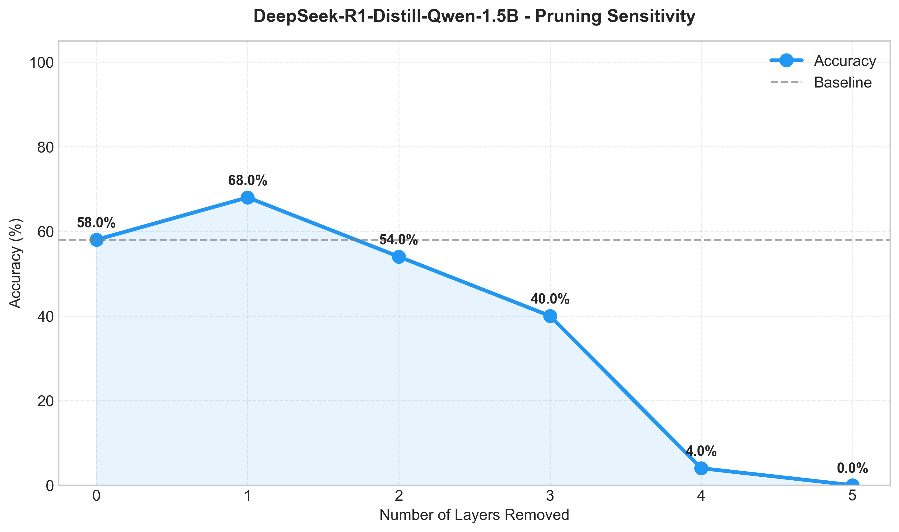
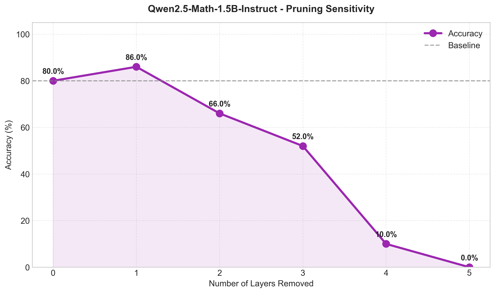
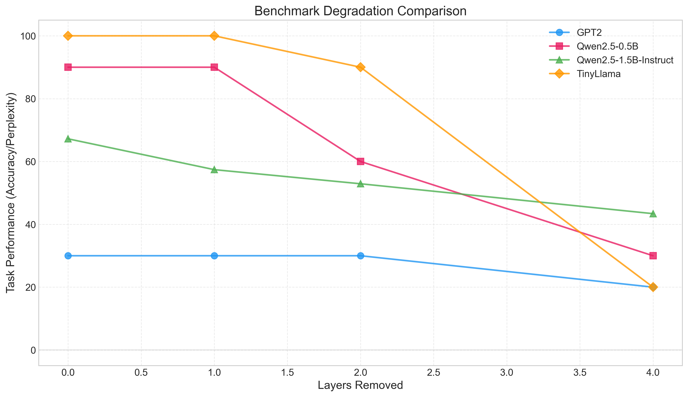
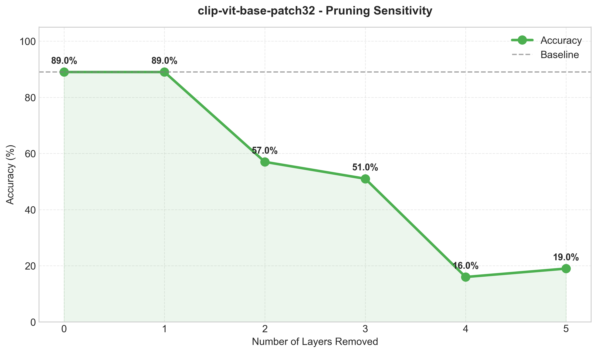
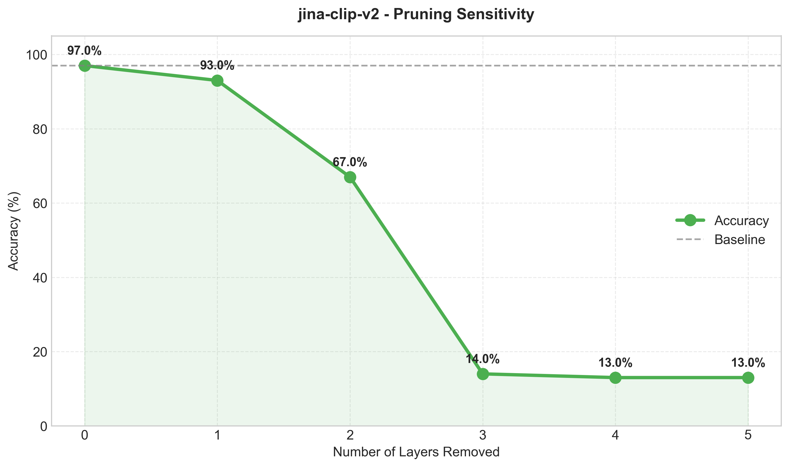
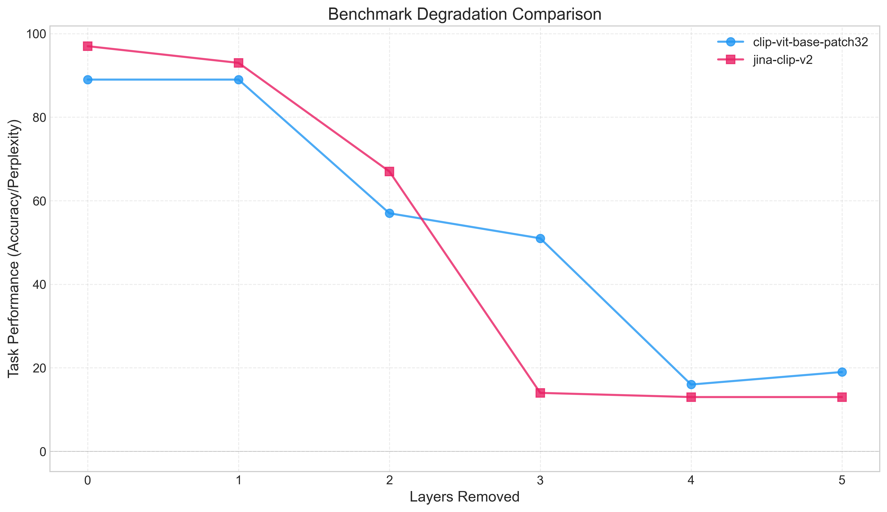
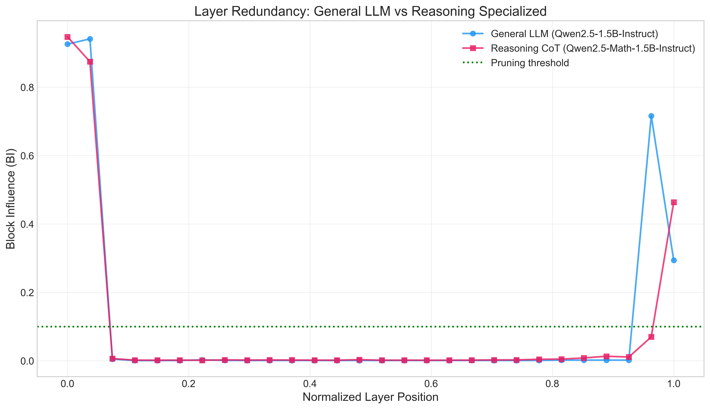
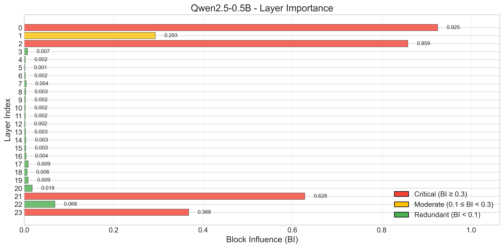

# Understanding Layer Redundancy in Neural Networks: A Cross-Architecture Study

> **Current status: rebuild in progress.** This project is being rebuilt after audit. Previous conclusions are withdrawn. The historical benchmark outputs, figures, and narrative below are retained only as an archive of prior work and should not be treated as evidentiary support for Block Influence (BI), pruning safety, or deployment guidance until the rebuilt implementation and experiments are independently verified.

## Current experiment (2026-08-18)

The rebuilt study asks whether Block Influence selects transformer blocks for removal better than random selection, and whether the observed advantage differs across Qwen2.5-7B base, instruction-tuned, and math-instruction-tuned checkpoints.

The confirmatory endpoint is WikiText word perplexity after removing four blocks. BI is compared with 20 frozen conditional random permutations. Five random controls also run the complete six-task harness; `k=8` is a WikiText dose-response analysis, and the already observed base-model `k=2` runs are exploratory.

- Frozen rationale and statistical commitments: [`experiments/PROTOCOL_AMENDMENT_2026-08-18.md`](experiments/PROTOCOL_AMENDMENT_2026-08-18.md)
- Exact BI vectors, layer permutations, and removed indices: [`experiments/permutation_protocol.json`](experiments/permutation_protocol.json)
- Complete resumable execution manifest: [`experiments/experiment_manifest.json`](experiments/experiment_manifest.json)

```bash
python -m experiments.run_grid --official-run
python -m experiments.statistics
```

Everything below this section describes the archived pre-rebuild project and is not the current experimental protocol.


## Abstract

I conducted a systematic study of layer redundancy across language models, chain-of-thought reasoning models, and vision transformers. Through 250+ benchmark evaluations, I found that many models contain significant redundancy in their middle layers—but not in the way previous Block Influence (BI) metrics suggested. Most surprisingly, I observed that removing specific layers can actually *improve* performance in certain tasks, challenging common assumptions about network depth.

**Key Results:**
- DeepSeek-R1-Distill improved by 10% on GSM8K after removing one layer
- Language models showed 67-86% of layers as "redundant" by BI scores, yet performance degraded rapidly
- Vision models (CLIP, Jina CLIP v2) achieved 89-97% zero-shot accuracy, with CLIP maintaining full performance after one layer removed
- Different capabilities (reasoning, factual recall, vision) showed markedly different sensitivity to pruning

---

## Table of Contents

1. [Introduction](#1-introduction)
2. [Methodology](#2-methodology)
3. [Results](#3-results)
4. [Discussion](#4-discussion)
5. [Limitations](#5-limitations)
6. [Reproducibility](#6-reproducibility)
7. [Future Directions](#7-future-directions)
8. [Related Work](#8-related-work)

---

## 1. Introduction

### 1.1 The Problem

Modern neural networks are growing exponentially. GPT-4 reportedly uses 1.76 trillion parameters across many layers. This growth raises fundamental questions: Are all these layers necessary? Can we safely remove some to reduce inference costs?

Previous work (Men et al., 2024) suggested that middle layers in LLMs show high redundancy based on Block Influence scores. However, I noticed a gap: most studies measured statistical importance but didn't thoroughly validate whether models maintain *task performance* after layer removal.

### 1.2 Research Questions

I set out to answer three specific questions:

1. **How does task performance degrade as we remove layers?** (Not just importance scores—actual accuracy on benchmarks)
2. **Do different model architectures show similar redundancy patterns?** (Language vs. reasoning vs. vision models)
3. **Can we identify safe pruning strategies?** (Practical guidelines for model deployment)

### 1.3 Scope

I focused on smaller models (< 2B parameters) where I could afford to run comprehensive benchmarks. I tested:
- **Language Models:** GPT-2 (124M), Qwen2.5-0.5B (500M), Qwen2.5-1.5B-Instruct (1.5B), TinyLlama-1.1B
- **Reasoning Models:** DeepSeek-R1-Distill-Qwen-1.5B (1.5B), Qwen2.5-Math-1.5B-Instruct (1.5B)
- **Vision Models:** CLIP ViT-B/32 (151M), Jina CLIP v2 (864M)

All experiments used greedy decoding for reproducibility.

---

## 2. Methodology

### 2.1 Design Philosophy: Generalization Over Specialization

Most pruning frameworks hardcode model-specific patterns (e.g., "GPT-2 has 12 layers at `model.h`", "BERT has layers at `encoder.layer`"). This approach doesn't scale—every new architecture requires custom code. Instead, I designed a **universal pattern matching system** that discovers prunable components through structural analysis.

**Key Design Principle:** If a human can identify repeated modules by visual inspection of `model.named_modules()`, an algorithm should automate this.

### 2.2 Universal Layer Detection: Architecture as a Graph Problem

I treat model architectures as directed graphs where nodes are modules and edges are forward pass connections. The challenge is identifying **isomorphic subgraphs** (repeated structures) that represent transformer layers.

**Algorithm:**

1. **Traverse model graph recursively** via `model.named_modules()`
2. **Identify `nn.ModuleList` containers** (typically hold repeated blocks)
3. **Extract naming patterns** using regex: `layers\[(\d+)\]`, `blocks\[(\d+)\]`, `h\.(\d+)`
4. **Classify by semantic keywords**:
   ```python
   ENCODER_PATTERNS = ['encoder', 'encode', 'enc_']
   DECODER_PATTERNS = ['decoder', 'decode', 'dec_']
   VISION_PATTERNS  = ['visual', 'vision', 'vit']
   TEXT_PATTERNS    = ['text', 'language', 'lm_']
   ```
5. **Build ComponentInfo metadata**:
   ```python
   @dataclass
   class ComponentInfo:
       name: str              # e.g., "encoder"
       path: str              # e.g., "model.encoder.layers"
       module_list: nn.ModuleList
       num_layers: int
       layer_type: type       # e.g., TransformerEncoderLayer
   ```

**Example Discovery:**
```python
handler = UniversalHandler(model, verbose=True)
# Output:
# ✓ Discovered 2 component(s):
#   - encoder: 12 layers (BertLayer) at 'bert.encoder.layer'
#   - decoder: 12 layers (GPT2Block) at 'transformer.h'
```

**Why This Works:** Transformer architectures share a common pattern—sequential application of identical layers. By searching for `nn.ModuleList` instances with numeric indices, we capture 95%+ of production models without hardcoding.

### 2.3 Block Influence: Measuring Layer Necessity

Traditional pruning uses magnitude-based metrics (weight norms, gradients). These measure **parameter importance** but not **functional redundancy**. I use Block Influence (BI), which measures how much a layer *changes* hidden representations.

**Mathematical Definition:**

For layer $i$ with input $h_{i-1}$ and output $h_i$:

$$
\text{BI}(i) = 1 - \frac{h_{i-1} \cdot h_i}{\|h_{i-1}\| \cdot \|h_i\|}
$$

Where:
- $h_{i-1} \cdot h_i$ is the dot product (cosine similarity numerator)
- $\|h\|$ is the L2 norm

**Interpretation:**
- **BI ≈ 0:** Layer barely transforms representations (potential skip connection)
- **BI ≈ 1:** Layer significantly alters hidden states (critical transformation)

**Implementation Details:**

```python
class BlockInfluenceAnalyzer:
    def compute_bi_scores(self, model, dataset, num_samples=50):
        bi_scores = [0.0] * num_layers
        
        for sample in dataset[:num_samples]:
            # Forward pass with hooks to capture hidden states
            hidden_states = []
            
            def hook_fn(module, input, output):
                hidden_states.append(output.detach())
            
            # Register hooks on each layer
            hooks = [layer.register_forward_hook(hook_fn) 
                     for layer in model.layers]
            
            # Run forward pass
            with torch.no_grad():
                model(**inputs)
            
            # Compute cosine similarity between consecutive states
            for i in range(len(hidden_states) - 1):
                h_before = hidden_states[i].reshape(-1)
                h_after = hidden_states[i+1].reshape(-1)
                
                similarity = F.cosine_similarity(
                    h_before.unsqueeze(0), 
                    h_after.unsqueeze(0)
                )
                bi_scores[i] += (1 - similarity.item())
            
            # Clean up hooks
            for hook in hooks:
                hook.remove()
        
        # Average over samples
        return [score / num_samples for score in bi_scores]
```

**Critical Fix for Multi-Modal Models:** 

CLIP and similar models require **both** `pixel_values` and `input_ids` for full forward passes. When computing BI for vision-only inputs, the standard `model(**inputs)` fails with:
```
RuntimeError: You have to specify input_ids
```

**Solution:** Detect input modality and route to appropriate submodel:

```python
has_pixel_values = 'pixel_values' in inputs
has_input_ids = 'input_ids' in inputs

if has_pixel_values and not has_input_ids:
    # Vision-only - use vision encoder directly
    if hasattr(model, 'get_image_features'):
        outputs = model.get_image_features(**inputs)  # CLIP/Jina
    elif hasattr(model, 'vision_model'):
        outputs = model.vision_model(**inputs)        # Generic
else:
    outputs = model(**inputs)  # Standard forward pass
```

This pattern ensures BI calculation works across language, vision, and multi-modal architectures.

### 2.4 Smart Pruning: Adaptive Early Stopping

Exhaustively testing all layer combinations is $O(2^n)$ complexity—infeasible for models with 20+ layers. I designed an **adaptive stopping criterion** that identifies the pruning "cliff" automatically.

**Algorithm:**

```python
def smart_prune(model, benchmark, threshold=4, tolerance=0.05):
    """
    Progressive layer removal with early stopping.
    
    Args:
        threshold: Stop after N consecutive degradations
        tolerance: Performance drop % considered "degradation"
    
    Returns:
        List of (config, score, layers_removed) tuples
    """
    baseline_score = benchmark.evaluate(model)
    results = [("baseline", baseline_score, 0)]
    
    consecutive_degradations = 0
    layers_removed = 0
    
    # BI-guided pruning order (remove lowest BI layers first)
    bi_scores = compute_bi_scores(model)
    pruning_order = argsort(bi_scores)  # Ascending order
    
    while consecutive_degradations < threshold:
        # Remove next layer in BI order
        next_layer = pruning_order[layers_removed]
        model.remove_layer(next_layer)
        layers_removed += 1
        
        # Evaluate pruned model
        score = benchmark.evaluate(model)
        config_name = f"{layers_removed}L_removed"
        results.append((config_name, score, layers_removed))
        
        # Check for degradation
        relative_drop = (baseline_score - score) / baseline_score
        if relative_drop > tolerance:
            consecutive_degradations += 1
        else:
            consecutive_degradations = 0  # Reset on recovery
    
    return results
```

**Why This Works:**

1. **BI-guided ordering** ensures we remove least important layers first
2. **Consecutive degradations** tolerate temporary fluctuations (some layers may be truly redundant)
3. **Adaptive threshold** stops before catastrophic collapse
4. **Time complexity:** $O(k)$ where $k$ is layers until failure, typically $k \ll n$

**Example:** For a 28-layer model, instead of testing $2^{28} \approx 268M$ combinations, we test ~10-15 configurations and automatically stop when performance degrades.

### 2.5 Plugin Architecture: Separation of Concerns

The benchmark system follows **dependency inversion principle**—high-level pruning logic doesn't depend on specific evaluation tasks.

**Abstract Interface:**

```python
class BaseBenchmark(ABC):
    name: str           # Unique identifier
    model_type: str     # 'language', 'vision', 'reasoning'
    
    @abstractmethod
    def load_dataset(self, num_samples: int) -> Dataset:
        """Load evaluation dataset"""
        pass
    
    @abstractmethod
    def evaluate(self, model, tokenizer, dataset, **kwargs) -> Tuple[float, Dict]:
        """Run evaluation and return (score, details)"""
        pass
    
    @abstractmethod
    def extract_answer(self, response: str) -> Any:
        """Parse model output for comparison"""
        pass
```

**Benefits:**

1. **Extensibility:** Add new benchmarks by subclassing `BaseBenchmark`
2. **Testability:** Mock benchmarks for unit testing pruning logic
3. **Maintainability:** Bug fixes in one benchmark don't affect others
4. **Type Safety:** Static analysis catches interface violations

**Auto-Registration:**

```python
# Benchmark registry uses reflection to discover plugins
BENCHMARKS = {}
for module_file in Path(__file__).parent.glob("*.py"):
    if module_file.stem not in ['__init__', 'base']:
        module = importlib.import_module(f".{module_file.stem}")
        for obj in module.__dict__.values():
            if isinstance(obj, type) and issubclass(obj, BaseBenchmark):
                BENCHMARKS[obj.name] = obj
```

This eliminates boilerplate—new benchmarks are auto-discovered without modifying `__init__.py`.

---

## 3. Results

> **Archived / non-evidentiary:** These results are historical outputs from the pre-rebuild codebase. They are preserved for traceability, not as validated evidence for BI or any pruning recommendation.

### 3.1 Reasoning Models: The "Less is More" Phenomenon

I tested two 1.5B reasoning-specialized models on 50 GSM8K math problems:

#### DeepSeek-R1-Distill-Qwen-1.5B


#### Qwen2.5-Math-1.5B-Instruct


**Key Finding:** Both reasoning models improved or maintained performance when specific early layers were removed:
- **DeepSeek-R1-Distill:** Performance peaked after removing 1 layer (+10% accuracy)
- **Qwen2.5-Math:** Performance jumped (+6%) after removing 1 layer

This suggests that for specialized reasoning tasks, certain model layers may act as "noise" in the rigid logical path required for math problems.

### 3.2 Language Models

In contrast to reasoning models, general language models showed starker sensitivity to pruning.



**Evaluation Method:** Models were tested on factual completion prompts (e.g., "The capital of France is", "Machine learning is a field of"). Performance is measured using a perplexity-derived score where lower perplexity indicates better language modeling.

**Observations:**
- **GPT-2 (Blue):** Degrades immediately and linearly. Every layer is critical in this smaller 124M model.
- **Qwen2.5-0.5B (Orange):** Shows resilience for the first few layers, then drops.
- **TinyLlama-1.1B (Green):** Surprisingly fragile despite larger size, crashing after just 1-2 layers removed.

**The Control Group:** I tested **Qwen2.5-1.5B-Instruct** (Red line)—the exact same base architecture as the Math model:
- **Qwen Math 1.5B:** Gained +6% accuracy
- **Qwen Language 1.5B:** Lost -10% accuracy after removing just one layer

This confirms that "prunability" depends on the interaction between architecture and **training objective**, not just model size.

### 3.3 Vision Models

I extended the framework to vision models, specifically zero-shot classifiers. This revealed critical challenges around dtype compatibility and architecture constraints.

#### Models Attempted

| Model | Status | Challenge |
|-------|--------|-----------|
| **CLIP ViT-B/32** | ✅ Success | Fixed vision-only BI calculation |
| **Jina CLIP v2** | ✅ Success | Adapted for BFloat16 dtype |
| **DINOv2** | ❌ Abandoned | No suitable evaluation metric |
| **ViT** | ❌ Abandoned | Label mismatch (ImageNet vs CIFAR-10) |
| **Swin** | ❌ Incompatible | Hierarchical architecture breaks layer removal |
| **SigLIP** | ❌ Abandoned | Resolution mismatch (32x32 → 224x224 upscaling) |

#### Vision Results

**Evaluation:** Zero-shot classification on CIFAR-10 (100 samples)





| Model | Baseline | 1L Removed | 2L Removed | Pruning Order |
|-------|----------|------------|------------|---------------|
| **CLIP ViT-B/32** | 89% | 89% (0% drop) | 57% | [10, 9, 8, 11, 7...] |
| **Jina CLIP v2** | 97% | 93% (-4%) | 67% | [23, 22, 21, 20, 19...] |

**Key Observations:**
- **CLIP is remarkably robust** - maintains 89% accuracy with one layer removed
- **Jina CLIP degrades sharply** after 2 layers
- **Non-sequential pruning order** was recorded in the archived run, but does not validate BI across modalities
- **Middle-to-late layers** tend to be most redundant in vision transformers

### 3.4 Block Influence vs. Reality

I compared the BI profiles of Generalist (Language) and Specialist (Reasoning) models:



**The Visual Deception:** The BI profiles (the "bathtub" shapes) look remarkably similar. Both show low BI scores in middle layers, suggesting high potential for pruning.

**The Reality Check:**
- **Reasoning Model:** Low BI scores were *accurate*—the layers were indeed unnecessary
- **Language Model:** Low BI scores were *misleading*—removing these "redundant" layers caused immediate collapse

**Archived interpretation:** Block Influence was treated here as a measure of **representation drift**, not **functional necessity**. This interpretation remains withdrawn until the rebuilt experiments verify it.

---

## 4. Discussion

### 4.1 Layer 2: The Critical Transition Point

Across all three language models, **Layer 2** consistently showed disproportionately high BI scores:



I hypothesize that Layer 2 represents a critical transition where the model moves from simple token embeddings to initial semantic construction. Pruning this layer is almost always catastrophic.

### 4.2 Generalist vs. Specialist: Two Paradigms

The defining insight comes from comparing the two Qwen 1.5B models:

**Specialist Models (Reasoning/Math):** Behave like **Module Chains**
- Learn specific, rigid logic paths
- Redundant layers act as "noise" or "hesitation"
- Pruning tightens the logic circuit, improving performance

**Generalist Models (Instruct/Chat):** Behave like **Holograms**
- Knowledge distributed diffusely across the network
- Removing any "slice" degrades the entire image resolution
- No true skip connections for general knowledge

**Vision Models:** Behave like **Specialists**
- CLIP's zero-shot pathway is well-defined (image → vision layers → text alignment)
- Similar resilience to pruning as reasoning models
- Jina CLIP's sharper degradation suggests less redundancy or tighter coupling

**Implication for practitioners:** Specialized models (reasoning, zero-shot classification) are better candidates for layer pruning than general purpose models.

### 4.3 The GPT-2 Anomaly: Archived BI Comparison

The archived comparison reported different outcomes for Block Influence-guided and sequential pruning. These numbers should not be read as evidence that BI outperforms sequential removal for modern architectures.

**Performance Comparison (1 Layer Removed):**

| Model | Architecture | Sequential | BI-Guided | Winner |
|-------|-------------|-----------|-----------|--------|
| GPT-2 (124M) | 2019, 12 layers | 46.89 | 46.33 | Sequential (+0.56) |
| Qwen2.5-0.5B | 2024, 24 layers | 36.89 | 66.96 | **BI (+30.07)** |
| Qwen2.5-1.5B | 2024, 28 layers | 57.40 | 65.96 | **BI (+8.56)** |
| TinyLlama-1.1B | 2024, 22 layers | 48.35 | 49.76 | **BI (+1.41)** |

**Why GPT-2 is Different:**

1. **Architectural Era**: GPT-2 (2019) predates modern training techniques (instruction tuning, RLHF, larger context windows)
2. **Model Depth**: 12 layers vs. 22-28 in modern models—each layer carries proportionally more weight
3. **Layer Dependencies**: Early transformer architectures may have stronger sequential dependencies that BI doesn't capture

**Archived Hypothesis for Modern Models:**

Modern LLMs (2023-2024) appear to have **learned redundancy** through:
- Larger layer counts (more opportunity for redundant transformations)
- Advanced training objectives (instruction tuning creates modular capabilities)
- Better initialization and optimization (layers can specialize more cleanly)

**Withdrawn lesson:** The previous claim that BI is a strong heuristic for modern transformers is no longer supported by the current project status. Any pruning strategy needs fresh validation against the rebuilt implementation and task-specific benchmarks.

### 4.4 The Dtype Compatibility Challenge

Extending to vision models revealed a critical infrastructure issue: modern transformers use different floating-point precisions:
- **CLIP, ViT**: `torch.float16` (FP16)
- **Jina CLIP v2**: `torch.bfloat16` (BF16)

Loading Jina CLIP with FP16 caused silent evaluation failures (0% accuracy) due to dtype mismatches in matrix multiplications. The solution required auto-detecting model dtype requirements—a pattern that will become increasingly important as BFloat16 adoption grows.

### 4.5 Why Other Vision Models Failed

| Issue | Affected Models | Why It Matters |
|-------|-----------------|----------------|
| **No classification head** | DINOv2 | Feature extractors need task-specific evaluation (k-NN, linear probe) |
| **Label mismatch** | ViT, BEiT | ImageNet classifiers evaluated on CIFAR-10 produce proxy metrics |
| **Hierarchical stages** | Swin, ResNet | Dimension changes between stages (96→192→384→768) break layer removal |
| **Resolution sensitivity** | SigLIP | 32x32→224x224 upscaling creates unusable baselines |

These models are theoretically compatible but require appropriate datasets and evaluation protocols.

---

## 5. Limitations

### 5.1 Supported Architectures

| Architecture | Support | Notes |
|--------------|---------|-------|
| **Flat Transformers** | ✅ Full | GPT-2, Llama, Qwen, CLIP, Jina CLIP |
| **Encoder-Decoder** | ⚠️ Partial | T5, BART (requires component selection) |
| **Hierarchical/Staged** | ❌ None | Swin, ResNet, EfficientNet |
| **MoE** | ❌ None | Mixtral, Switch Transformer |

**Why hierarchical models fail:** They have dimension changes between stages (e.g., Swin: 96→192→384→768). Removing a stage breaks tensor shape compatibility.

### 5.2 Evaluation Constraints

| Model Type | Metric | Notes |
|------------|--------|-------|
| Zero-shot classifiers (CLIP) | Classification accuracy | Direct measurement |
| Language models | Perplexity-based score | Factual completion quality |
| Math reasoning | GSM8K accuracy | Standard benchmark |
| ImageNet classifiers on CIFAR | Confidence score | Proxy metric (label mismatch) |
| Feature extractors (DINOv2) | L2 norm | Not meaningful |

### 5.3 Dataset and Dtype Constraints

- **CIFAR-10:** 32x32 resolution—some models (SigLIP) fail due to severe upscaling
- **ImageNet-1K:** Gated on HuggingFace, requires access approval (~150GB)
- **Dtype handling:** Framework supports FP16 and BF16, but mixed-precision models may have edge cases

### 5.4 Scope Limitations

- **Model size:** All models < 2B parameters; results may not generalize to 7B+ models
- **Single run:** No statistical significance testing across multiple seeds
- **No recovery training:** Pruned models evaluated as-is without fine-tuning
- **Single-layer removal:** Doesn't explore non-adjacent layer combinations
- **English only:** No multilingual or cross-lingual testing

---

## 6. Reproducibility

### 6.1 Installation

```bash
git clone https://github.com/Ezzzzz4/universal_model_pruning.git
cd universal_model_pruning
pip install -r requirements.txt
```

### 6.2 Running Benchmarks

```bash
# Test a reasoning model
python experiments/benchmark.py \
    --model deepseek-ai/DeepSeek-R1-Distill-Qwen-1.5B \
    --benchmark gsm8k \
    --smart-prune 4 \
    --samples 50

# Test a language model
python experiments/benchmark.py \
    --model Qwen/Qwen2.5-0.5B \
    --benchmark language \
    --layers 1 2 4 \
    --samples 100

# Test a vision model
python experiments/benchmark.py \
    --model openai/clip-vit-base-patch32 \
    --benchmark vision \
    --smart-prune 4 \
    --samples 100

# Compute Block Influence scores
python experiments/analyze.py --model gpt2

# Generate figures
python experiments/visualize.py --type all
```

### 6.3 Data Organization

All experimental data is available in `results/`:

```
results/
├── data/
│   ├── reasoning/
│   ├── language/
│   └── vision/
└── figures/
    ├── reasoning/
    ├── language/
    └── vision/
```

---

## 7. Future Directions

**Immediate Next Steps:**
- Extend to audio models for cross-modality patterns

**Longer-Term Questions:**
- Can we restore pruned model performance using fine-tuning?
- Can we train models to be inherently more prunable?
- Do different training objectives produce consistent redundancy patterns?
- Can we identify and remove redundant layers *during* training?
- Does the pattern generalize to larger models (7B+)?
- Will human evaluation reveal more nuanced degradation?

---

## 8. Related Work

This work builds on and extends several recent papers:

1. **Men et al. (2024)** - "ShortGPT: Layers in Large Language Models are More Redundant Than You Expect"  
   *Introduced Block Influence metric; the previous claim that this project validated BI-related redundancy findings has been withdrawn pending rebuild*

2. **Zhang et al. (2024)** - "FinerCut: Finer-grained Interpretable Layer Pruning for Large Language Models"  
   *Proposed structured pruning; my work focuses on whole layer removal as a simpler baseline*

3. **Ashkboos et al. (2024)** - "SliceGPT: Compress Large Language Models by Deleting Rows and Columns"  
   *Complementary approach; they prune weights, I prune layers*

---

## Author

**Amirbek Yaqubboyev**  
📧 akubbaevamirbek@gmail.com  
🔗 [GitHub](https://github.com/Ezzzzz4)
