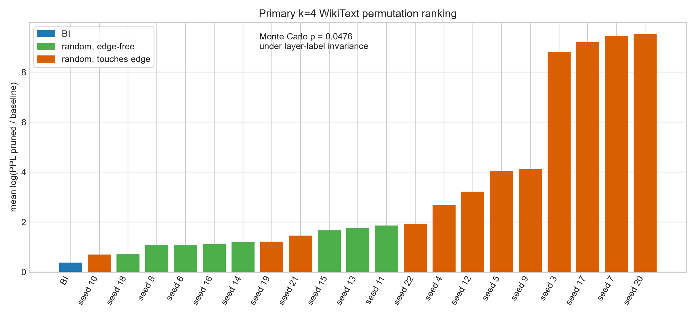
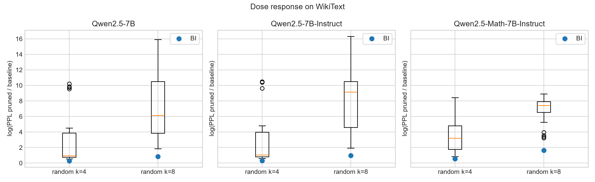

# Block Influence vs. Random Layer Pruning

This repository tests whether Block Influence (BI), introduced in ShortGPT (Men et al., 2024), selects transformer blocks for removal better than random selection. It also asks whether any BI advantage changes after instruction or mathematics fine-tuning.

## Status

**All 133 official configurations are complete; confirmatory analysis is available.**

The repository was rebuilt after an engineering audit invalidated the old evidentiary basis. All earlier conclusions are withdrawn. Old JSON files and figures remain under [`results/archive/`](results/archive/) for traceability, but they do not support claims about BI or pruning quality.

The current evidence consists of the exploratory `k=2` pilot, the frozen `k=4` comparison, and the preregistered descriptive `k=8` dose response across three Qwen2.5-7B checkpoints. In the primary WikiText test, BI ranks better than all twenty frozen random layer-label permutations. The result supports a narrow claim: under this conditional permutation protocol, BI selected less damaging `k=4` layer removals than the controls tested here.

- [Exploratory pilot results](results/preliminary/PILOT_RESULTS_2026-08-27.md)
- [Exact pilot metrics and run identifiers](results/preliminary/pilot_k2_summary.json)
- [Confirmatory analysis summary](results/confirmatory/summary.json)
- [Readable confirmatory results](results/confirmatory/RESULTS.md)
- [Exported official aggregate records](results/confirmatory/official_runs.jsonl)
- [Confirmatory figures](results/confirmatory/figures/)
- [Short STEM activity brief](results/preliminary/STEM_ACTIVITY_BRIEF.md)
- [Frozen protocol amendment](experiments/PROTOCOL_AMENDMENT_2026-08-18.md)
- [Post-run analysis implementation note](experiments/ANALYSIS_IMPLEMENTATION_NOTE_2026-09-02.md)
- [Exact layer permutations and BI selections](experiments/permutation_protocol.json)
- [Resumable experiment manifest](experiments/experiment_manifest.json)

## Research question

The primary question is:

> At a fixed pruning level, does BI select blocks whose removal preserves model quality better than random block selection?

The secondary question compares three related 7B checkpoints:

| Key | Model | Frozen Hugging Face revision |
|---|---|---|
| `base` | `Qwen/Qwen2.5-7B` | `d149729398750b98c0af14eb82c78cfe92750796` |
| `instruct` | `Qwen/Qwen2.5-7B-Instruct` | `a09a35458c702b33eeacc393d103063234e8bc28` |
| `math` | `Qwen/Qwen2.5-Math-7B-Instruct` | `ef9926d75ab1d54532f6a30dd5e760355eb9aa4d` |

A negative result is valid. The design tests for an advantage; it does not assume one.

## Why the repository was rebuilt

The old repository looked more complete than its implementation and data justified. The audit found several independent problems:

| Earlier problem | Why it mattered | Current response |
|---|---|---|
| The README described classes and architecture that did not exist. | A reader could not map the claimed design to executable code. | This README describes only tracked files and tested entry points. |
| Bespoke language, vision, and GSM8K benchmarks used tiny prompt sets or proxy scores. | Those scores could not answer whether BI beats random pruning on accepted language-model evaluations. | The current study delegates all scoring to a pinned `lm-evaluation-harness` revision. |
| Two BI paths used different padding, precision, masking, and averaging rules. | The selected blocks could depend on implementation details instead of the metric's intended definition. | One canonical implementation uses token-wise FP32 cosine distance and masks padding. The legacy calculation remains only as a named sensitivity analysis. |
| Layer removal left stale metadata, mutated copied-handler state, replaced `Sequential` containers, and accepted invalid indices. | Later operations could observe a model structure different from the actual pruned model. | Targeted fixes preserve container types, validate indices, and keep handler metadata synchronized. |
| Old result files mixed strategies and lacked complete provenance. | Figures could combine incompatible runs, and results could not be reconstructed reliably. | Official runs append JSONL records with exact layers, seeds, model and code revisions, package versions, timings, and per-sample logs. |
| Three random seeds were treated as an adequate control. | The pilot showed that different random layer sets can produce widely different degradation. | The confirmatory protocol freezes twenty conditional random permutations before analysis. |

Git history preserves the old README. It is not part of the current scientific claim.

## Current experimental design

### Block Influence

For each decoder block, canonical BI computes the cosine distance between its input and output hidden states for each token. It then:

1. performs the cosine calculation in FP32;
2. excludes padding with `attention_mask`;
3. averages real tokens within each example;
4. averages examples, including a correctly weighted final partial batch;
5. removes all hooks and restores the model's previous train/eval state, even after failure.

The fixed calibration corpus contains 128 WikiText-2 documents and is shared across all checkpoints. The stored BI bundles also include the older flattened FP16 calculation and the rank correlation between the two definitions.

### Evaluation

The harness revision is fixed at `8a07e1110d060de48cfc7a9a7987b7659060b60b`. Every full evaluation uses the complete datasets and records sample-level outputs.

| Task | Reported metric | Direction |
|---|---|---|
| WikiText | word perplexity | lower is better |
| ARC-Challenge | normalized accuracy | higher is better |
| PIQA | normalized accuracy | higher is better |
| Winogrande | accuracy | higher is better |
| HellaSwag | normalized accuracy | higher is better |
| Lambada OpenAI | accuracy | higher is better |

WikiText perplexity at `k=4` is the primary endpoint. The multiple-choice tasks are secondary outcomes.

### Random control

The confirmatory design applies twenty frozen permutations of the 28 layer labels to the BI-selected sets. Applying the same permutation across checkpoints preserves their observed overlap structure and keeps `k=4` nested inside `k=8`. The primary test ranks BI among the identity permutation and twenty random permutations. Exact indices—not generated choices at run time—are stored in [`experiments/permutation_protocol.json`](experiments/permutation_protocol.json).

The manifest contains 133 configurations: 25 full six-task runs and 108 WikiText-only runs. The completed evidence index contains one successful official record for every manifest key.

## Confirmatory result

The primary endpoint is WikiText word perplexity at `k=4`. Lower is better. The primary statistic is the mean across models of `log(PPL_pruned / PPL_baseline)`.

| Model | Baseline PPL | BI PPL | Random PPL median | Random PPL range |
|---|---:|---:|---:|---:|
| Qwen2.5-7B | 9.4967 | 12.6763 | 24.2469 | 16.4578-260421.3424 |
| Qwen2.5-7B-Instruct | 10.1367 | 13.6588 | 28.7813 | 18.4209-361556.7230 |
| Qwen2.5-Math-7B-Instruct | 144.1987 | 246.1740 | 3589.8709 | 333.8323-660570.9400 |

Primary permutation test:

- BI statistic: `0.3739508014`
- exact one-sided p-value: `1/21 = 0.047619`
- robustness statistic, mean within-model rank: BI rank `1.0`, p-value `0.047619`
- paired WikiText document bootstrap for median-random advantage over BI: `1.4415` log-PPL units, 95% CI `[1.3778, 1.5053]`

Exponentiating that effect, the median random object's multiplicative degradation from baseline was `4.23x` BI's (`95% CI [3.97x, 4.51x]`). The p-value is the smallest attainable under the frozen 21-object design: one random object tying or beating BI would have raised it to at least `2/21 = 0.095238`.

The edge-layer diagnostic weakens a simple "BI beats random" story. Only 8 of the 20 random permutation objects avoided layers `{0, 1, 26, 27}` across all three models. BI still ranked better than every edge-free control, but the predeclared exact p-value within that subset is `1/9 = 0.111111`. The primary result is statistically positive for the full frozen conditional family; the edge-free analysis is positive in direction but underpowered.

The five full-task random seeds (`3-7`) give secondary, descriptive evidence. BI exceeds the random median on all five tasks for every checkpoint. It ranks first of six on ARC-Challenge, PIQA, HellaSwag, and Lambada, but only third of six on Winogrande for all three models. McNemar comparisons are therefore appendix evidence about particular layer sets, not proof that BI dominates the random strategy on every downstream task.

The preregistered `k=8` dose response is descriptive rather than primary. BI again ranks first of 21 for every checkpoint. Relative to each model's baseline, BI increases WikiText PPL by `2.30x` for Base, `2.61x` for Instruct, and `5.07x` for Math; the corresponding random medians are vastly worse. This suggests that the math-tuned checkpoint is more brittle under removal, but one checkpoint per training regime cannot establish a fine-tuning effect statistically.





Canonical BI and the legacy flattened FP16 calculation do not rank layers similarly for two of the three models:

| Model | Spearman correlation |
|---|---:|
| Qwen2.5-7B | 0.2899 |
| Qwen2.5-7B-Instruct | 0.2978 |
| Qwen2.5-Math-7B-Instruct | 0.6311 |

This sensitivity result matters for reproducibility: BI implementation details can materially change the layer ranking.

## Completed pilot

The published pilot compares one baseline, BI, and three random selections at `k=2` on Qwen2.5-7B. Each configuration covers 19,534 task or document samples.

| Selection | Removed blocks | WikiText PPL |
|---|---:|---:|
| Baseline | — | 9.4967 |
| BI | 16, 17 | 10.8339 |
| Random seed 0 | 3, 14 | 13.3581 |
| Random seed 1 | 23, 26 | 20.9333 |
| Random seed 2 | 3, 20 | 13.4949 |

BI had lower perplexity than these three random selections, but three controls cannot characterize the random-selection distribution. One random selection also exceeded BI on Winogrande. The pilot therefore motivated a stronger design; it did not settle the hypothesis.

## Repository map

```text
src/
  core/block_influence.py         canonical and legacy BI calculations
  handlers/universal_handler.py  layer discovery and removal
experiments/
  benchmark.py                   one pinned lm-eval configuration
  run_grid.py                    resumable manifest executor
  prepare_calibration.py         fixed WikiText calibration sample
  prepare_protocol.py            frozen permutations and run manifest
  statistics.py                  implementation of the frozen analysis rules
  visualize.py                   figures for the new confirmatory schema
  bi/                            stored BI bundles for three checkpoints
  calibration/                   shared calibration corpus
  experiment_manifest.json       exact 133-configuration queue
  permutation_protocol.json      exact model revisions and layer sets
results/
  preliminary/                   tracked exploratory pilot summary
  confirmatory/                  tracked results, aggregate records, and figures
  archive/                       withdrawn historical outputs
  lm_eval/                       local append-only raw runs and samples
tests/                            unit and integration tests
```

## Reproduce the code checks

The tested environment uses Python 3.11 on Windows and an NVIDIA RTX 5090 Laptop GPU. Dependencies, including the CUDA 12.8 PyTorch build and harness git revision, are pinned in [`requirements.txt`](requirements.txt).

```powershell
py -3.11 -m venv .venv
.\.venv\Scripts\python.exe -m pip install -r requirements.txt
.\.venv\Scripts\python.exe -m pytest -q
```

Inspect the frozen queue without starting evaluations:

```powershell
.\.venv\Scripts\python.exe -m experiments.run_grid --official-run --dry-run
```

An official run requires a clean git worktree, the pinned harness revision, the pinned model revision, and CUDA. To resume the queue intentionally:

```powershell
.\.venv\Scripts\python.exe -m experiments.run_grid --official-run
```

Raw official harness outputs live under `results/lm_eval/`, which is ignored by git because the sample logs total about 1.7 GB. The tracked aggregate export is small enough for Git; the summary records SHA-256 hashes for every one of the 133 input records and sample logs. A fresh clone cannot recompute the sample-level bootstrap or McNemar appendix unless those raw logs are supplied separately; their recorded hashes can authenticate such a copy. With the local raw artifacts present, regenerate the complete analysis and figures with:

```powershell
.\.venv\Scripts\python.exe -m experiments.statistics
.\.venv\Scripts\python.exe -m experiments.visualize
```

## Interpretation boundary

This repository shows that BI outperformed twenty frozen conditional random controls for `k=4` WikiText pruning on three related Qwen2.5-7B checkpoints. It does not prove that BI is generally better than random pruning across architectures, tasks, pruning levels, or fine-tuning recipes. The edge-free subset is underpowered, and the successful records include exact retries after nine technical failures; those failures remain listed in the analysis artifact. Differences between base, instruction-tuned, and math-tuned checkpoints are descriptive only because the design has one deterministic BI selection per checkpoint, not independent fine-tuning replicates. The harness revision is pinned, but the runs did not record immutable Hugging Face dataset revisions or fingerprints; per-document hashes verify alignment within this study but do not constitute a distributable dataset snapshot.

## License

MIT License. See [`LICENSE`](LICENSE).
